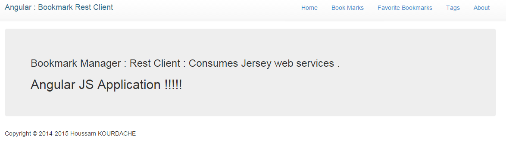
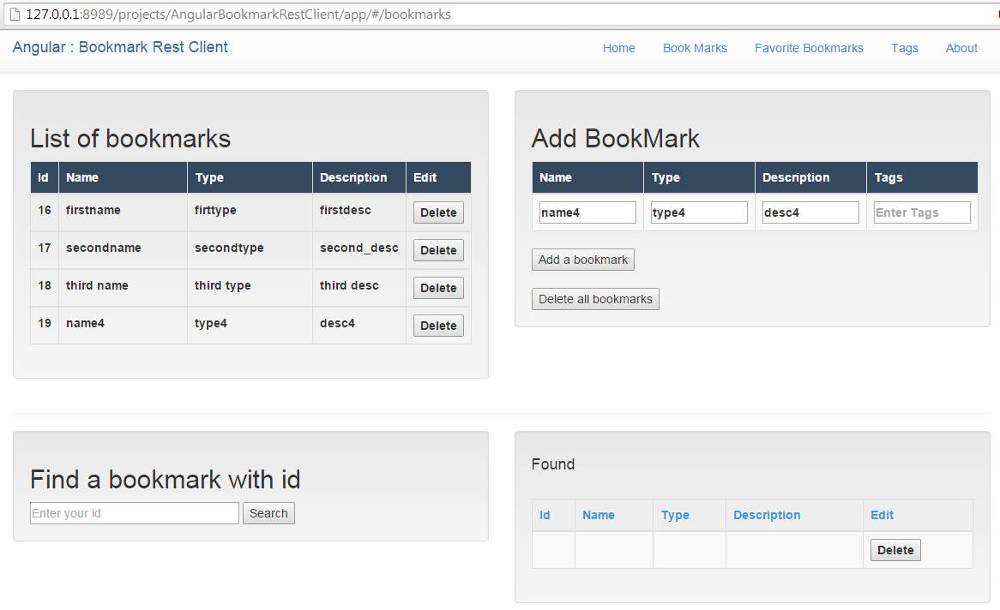
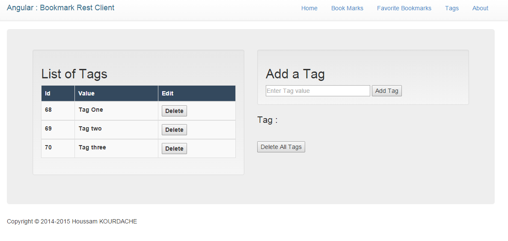

#Angular JS Rest Client:
###Consomation des web services Jersey REST avec Angular JS.


> Dans cet exemple, un client léger est développé avec Angular JS afin de consommer les web services
> déployés du côté serveur. Le lien vers le code déployant les web services:
> [Spring & Jersey web services].
> Effectuer les opérations CRUD : delete, Get, Post ...etc.
> Nous allons utiliser le module $http d'angular pour effectuer les opérations get/post/delete de http.
  

### Générer la structure de votre projet web Angular JS: 

> nous allons utiliser l'utile de scaffolding de [YEOMAN]. C'est un outil que vous pouvez installer 
> en trois lignes de commande via votre console et ainsi générer toute la structure et les dépendances 
> de votre projet Angular . Il suffit de taper la ligne de commande suivante au sein du répertoire de votre projet:

```sh
 $ mkdir mon-projet & cd mon-projet
 $ yo angular
```

> Pour plus d'informations sur l'utilisation de cet outil je vous invite à consulter ce [PDF] ou consulter directement cette
> page qui vous expliquera la démarche à suivre [YEOAMAN].


###### Après génération la structure de votre projet ressemblera à celle-ci:


###Création de l'application Angular:
> Par défaut un fichier app.js vous a été généré dans le dossier "/app.js".
> Voici son contenu:

```sh

var app=angular.module('angularBookmarkRestClientApp', [
    'ngAnimate',
    'ngCookies',
    'ngResource',
    'ngRoute',
    'ngSanitize',
    'ngTouch'
  ]);

app.config(function ($routeProvider) {
    $routeProvider.when('/', {
        templateUrl: 'views/main.html',
        controller: 'MainCtrl'
      })
      .when('/about', {
        templateUrl: 'views/about.html',
        controller: 'AboutCtrl'
      })      
      .when('/bookmarks', {
        templateUrl:'views/bookmarks.html',
        controller: 'BookmarksrestCtrl'
      })
      .when('/tags', {
        templateUrl:'views/tags.html',
        controller:'TagsrestcontrollerCtrl'
      })
      .otherwise({
        redirectTo: '/'
      });
  });


```
> Ce code déclare un module avec le mot clé "angular.module" dont le nom "angularBookmarkRestClientApp". Ainsi tout les composants que l'on créera comme par exemple les "factories", les "controllers", les "services" ...etc, seront associé à ce module "app". 

> Puis il lui associe les modules(plugins) angular que vous aviez choisi lors de l'étape de génération. Par exemple: le module ngRoute est utilisé dans la partie configuration de l'app, de sorte à pouvoir utiliser le fournisseur $routeProvider.

> Par la suite, on associe à notre module "app" une configuration. Là il s'agit seulement de configurer les routes, que l'on aurait pu écrire dans un autre fichier, comme par exemple "routes.js" que l'on crée avec la commande suivante:

```sh
$ yo angular:route routes
```
> Par la suite, on rajoute les routes au fournisseur $routeProvider. Pour déclarer une route, on définit le contrôleur et la vue que l'on affichera. Par exemple: à l'url "rest/bookmarks/" on lui associe le contrôleur "BookmarkcontrollerCtrl" et la vue "bookmarks.html".


### Création d'un composant Factory:
> Les appels réseaux Http, on les effectuera au sein d'un composant factory.
> Angular nous simplifie grandement les choses pour effectuer des requêtes http. Il suffit de déclarer le module $http et le passer
en paramètre à la classe "app.factory()".
> Voici le contenu du fichier restfactory.js:

```sh
angular.module('angularBookmarkRestClientApp').factory('RestFactory', ['$http', function ($http) {       
       // Liste des url des web services exposés côté serveur.       
       var url_base="http://localhost:9191/RestBookmarkManager/rest";
        var url_all_bookmarks="/bookmarks/getAll";
        var url_bookmark_by_id="/bookmarks/get/";
        var url_add_bookmark="/bookmarks/add";
        var url_all_tags="/tags/getAll";
        var url_tag_by_id="/tags/get/";
        var url_add_tag="/tags/add";
        var url_delete_tag="/tags/delete/";
        var url_delete_all_tags="/tags/delete/all";
        //Store data
        var dataFactory={};
        /**
         * Get BOOOKMARKS  Methods
         * @returns {HttpPromise}
         */
        dataFactory.getBookmarks=function(){
            return $http.get(url_base+url_all_bookmarks);
        };
        dataFactory.getBookmarkByID=function(id){
            return $http.get(url_base+url_bookmark_by_id+id);
        };
        /**
         * POST (INSERT) BOOOKMARKS  Methods
         * @returns {HttpPromise}
         */
        dataFactory.addNewBookmark=function(name, type, description){  
            var data={};
           
            // Effectuer la requete et renvoyer le résultat afin
            // de pouvoir utiliser depuis le controler bookmarkRestController.js
            // ci-dessous.
                     
            return $http({
                method:'POST',
                headers: {'Content-Type':'application/x-www-form-urlencoded; charset=UTF-8'},
                url:url_base+url_add_bookmark+"?name="+name+"&type="+type+"&description="+description,
                transformRequest: function(obj) {
                    var str = [];
                    for(var p in obj)
                        str.push(encodeURIComponent(p) + "=" + encodeURIComponent(obj[p]));                    
                    return str.join("&");
                },
                data:data                
            });           
        };    
         /**
         * Get TAGS  Methods
         * @returns {HttpPromise}
         */
        dataFactory.getTags=function(){          
            console.log("I'am in the factory");
            return $http.get(url_base+url_all_tags);
        };
        /**
         * POST (INSERT) TAGS  Methods
         * @returns {HttpPromise}
         */
        dataFactory.addNewTag=function(tagVal){
            var data={tag_value:tagVal};
            return $http({
                method:'POST',
                headers: {'Content-Type':'application/x-www-form-urlencoded; charset=UTF-8'},
                url:url_base+url_add_tag+"?tag_value="+tagVal,
                transformRequest: function(obj) {
                    var str = [];
                    for(var p in obj)
                        str.push(encodeURIComponent(p) + "=" + encodeURIComponent(obj[p]));                    
                    return str.join("&");
                },
                data:data                
            });           
        };    
        /**
        * Delete Tags Method
        * @returns {HttPromise}
        */
        dataFactory.deleteAllTags=function(){
            return $http({
                    method:'DELETE',
                    headers: {'Content-Type':'application/json'},
                    url:url_base+url_delete_all_tags ,
                    data:{tags:'tags'}
                });         
        };
        return dataFactory;     //Return final dataFactory methods results
      }]
  );
```

###Création du contrôleur bookmarkRestController.js:

  > Ce contrôleur jouera le rôle de récupérer les actions de l'utilisateur et d'appeler 
  > la bonne méthode de la "factory" (restFactory.js), pour déléguer la requête vers le bon web service.
  > Code source:

```sh
angular.module('angularBookmarkRestClientApp').controller('BookmarksrestCtrl', 
      ['$scope', 'RestFactory', function ($scope, RestFactory) {    
    $scope.bookmarks;    
    //Call getBookmarks function
    getBookmarks();
    console.log("I'am in controller");
    //getBookmarks function
    function getBookmarks(){        
        //Utiliser le composant RestFactory pour déléguer action de utilisateur 
        //vers le bon web service.
        RestFactory.getBookmarks()
            .success(
                function (bookmarks){
                    $scope.bookmarks=bookmarks;
                    console.log($scope.bookmarks);
                }
            )
            .error(
                function(error){
                     console.log("unable to load:(");
                    $scope.status="Unable to load bookmarks : Error : "+error;
                }
            )
    };
    // Function called from bookmarks.html to insert new tag to DB
    $scope.addNewBookmark=function(Bookmark){
        RestFactory.addNewBookmark(Bookmark.name, Bookmark.type, Bookmark.description)
            .success(function (data, status, headers, config){
                $scope.bookmark_inserted=data;
                getBookmarks(); //refresh list of bookmarks
            })
            .error(function(data, status, headers, config){
                console.log("error insert status :"+status);
            })
    };
     //function call from bookmarks.html to delete all bookmarks
    $scope.deleteAllBookmarks=function(){
        RestFactory.deleteAllBookmarks()
            .success(function (data, status, headers, config){
                $scope.nb_bm_deleted=data;
                getBookmarks();
            })
            .error(function(data, status, headers, config){
                console.log("Arror deleting all bookmarks");
            })
    };
```

###Création de la vue: bookmarks.html
> avec l'outil yeaoman, utiliser la commande suivante: yo angular:view bookmarks
> nous générera un fichier html qui sera stocké dans le répertoire "/views".

Voici son contenu:
```sh
<div class="row" > 
        <div class="col-md-6">           
            <div class="well">
              <h2>List of bookmarks</h2>
        <!-- Dispaly the content of $scope.bookmarks : list of bookmarks-->
        <table id="example" class="table  table-bordered" cellspacing="0" width="40%">  
            <thead style="color:white; background-color:#34495E;">
                <tr>
                    <th>Id</th>
                    <th>Name</th>
                    <th>Type</th>
                    <th>Description</th>
                    <th>Edit</th>
                </tr>        
            </thead>
            <tbody data-ng-repeat="bookmark in bookmarks">
              <tr>
                    <th  >{{bookmark.id}}</th>
                    <th class="col-sm-6">{{bookmark.name}}</th>
                    <th class="col-sm-6">{{bookmark.type}}</th>
                    <th class="col-sm-1">{{bookmark.description}}</th>
                    <th><button ng:click="bookmarks.$remove(bookmark)">Delete</button></th>
                </tr>             
            </tbody>
        </table>
            </div>
        </div>
        <div class="col-md-6">
           <div class="well">
          <h2>Add BookMark</h2> 
        <table id="example" class="table table-striped table-bordered" cellspacing="0" width="40%"> 
            <thead style="color:white; background-color:#34495E;">
                <tr>
                    <th>Name</th>
                    <th>Type</th>
                    <th>Description</th>    
                    <th>Tags</th>       
                </tr>        
            </thead>
            <tbody>
              <tr>
                    <th><input type="text" ng-model="Bookmark.name" name="id_name" size="10" placeholder="Enter name" ng:required /></th>
                    <th><input type="text" ng-model="Bookmark.type" name="id_type" size="10" placeholder="Enter type" ng:required /></th>
                    <th><input type="text" ng-model="Bookmark.description" name="id_desc" size="10" placeholder="Enter description" ng:required /></th>
                  <th><input type="text" name="id_tags" size="10" placeholder="Enter Tags" ng:required /></th>
                </tr>             
            </tbody>   
        </table>
        <button ng:click="addNewBookmark(Bookmark)">Add a bookmark</button>
        <br/><br>
            <button ng:click="deleteAllBookmarks()">Delete all bookmarks</button>
           </div>
    </div>  
</div>
<hr>
```

###Remarques : 
> Vous pouvez consulter le projet Spring/Jersey/JPA/DAO factory exposant les web services consommés via ce [lien].


### Quelques Captures d'écran:
**Home**
 
**Onglet Bookmarks**
 
**Onglet Tags**
 

[lien]:https://github.com/KourdacheHoussam/RestBookmarkManager/tree/master/RestBookmarkManager
[Spring & Jersey web services]:https://github.com/KourdacheHoussam/RestBookmarkManager/tree/master/RestBookmarkManager
[PDF]:https://github.com/KourdacheHoussam/Angular/blob/master/CoursFiches/Cours%20introduction%20%C3%A0%20Angular%20JS.pdf
[YEOAMAN]:http://yeoman.io/codelab/install-generators.html
[Cybercratos]:http://cybercratos.com/


**Houssam KOURDACHE [Cybercratos]**