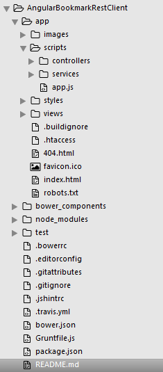

#Angular JS Rest Client:
###Consomation des web services Jersey REST avec Angular JS.


> Dans cet exemple, un client léger est développé avec Angular JS afin de consommer les web services
> déployés du côté serveur. Le lien vers le code déployant les web services:
> [Spring & Jersey web services].
> Nous allons utiliser le module $http d'angular pour effectuer les opérations get/post/delete de http.
	

### Générer la structure de votre projet web Angular JS: 

> nous allons utiliser l'utile de scaffolding de [YEOMAN]. C'est un outil que vous pouvez installer 
> en trois lignes de commande via votre console et ainsi générer toute la structure et les dépendances 
> de votre projet Angular . Il suffit de taper la ligne de commande suivante au sein du répertoire de votre projet:

```sh
 $ mkdir mon-projet & cd mon-projet
 $ yo angular
```

> Pour plus d'informations sur l'utilisation de cet outil je vous invite à consulter ce [PDF] ou consulter directement cette
> page qui vous expliquera la démarche à suivre [YEOAMAN].


###### Après génération la structure de votre projet ressemblera à celle-ci:



[Spring & Jersey web services]:https://github.com/KourdacheHoussam/RestBookmarkManager/tree/master/RestBookmarkManager
[PDF]:https://github.com/KourdacheHoussam/Angular/blob/master/CoursFiches/Cours%20introduction%20%C3%A0%20Angular%20JS.pdf
[YEOAMAN]:http://yeoman.io/codelab/install-generators.html